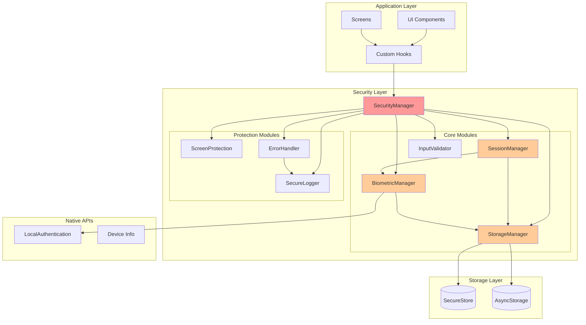

# Design Document - Cải Thiện Bảo Mật Ứng Dụng

## Overview

Tài liệu này mô tả thiết kế chi tiết cho việc cải thiện bảo mật toàn diện của ứng dụng NutriTrack. Ứng dụng hiện tại đã có các tính năng xác thực cơ bản nhưng tồn tại nhiều vấn đề bảo mật cần được giải quyết:

**Vấn đề hiện tại:**
- Session data (userId, email) đang được lưu trong AsyncStorage thay vì SecureStore
- Không có cơ chế session timeout hoặc auto-lock
- Thiếu giới hạn số lần thử xác thực sinh trắc học
- Console.log có thể leak sensitive data trong production
- Không có input validation và sanitization
- Thiếu bảo vệ screenshot/screen recording cho màn hình nhạy cảm
- Không có secure logging system
- Error messages có thể leak thông tin hệ thống

**Mục tiêu thiết kế:**
1. Tạo một Security Manager tập trung để quản lý tất cả các khía cạnh bảo mật
2. Phân tách rõ ràng giữa dữ liệu nhạy cảm (SecureStore) và dữ liệu công khai (AsyncStorage)
3. Implement session management với timeout và auto-lock
4. Cải thiện biometric authentication với rate limiting và biometric change detection
5. Tạo secure logging system thay thế console.log
6. Implement input validation và sanitization framework
7. Bảo vệ màn hình nhạy cảm khỏi screenshot/recording
8. Secure error handling không leak thông tin

**Phạm vi:**
- Refactor authService.ts thành SecurityManager với các modules con
- Tạo StorageManager để quản lý SecureStore và AsyncStorage
- Tạo SessionManager với timeout và auto-lock
- Cải thiện BiometricManager với rate limiting
- Tạo SecureLogger thay thế console.log
- Tạo InputValidator cho form validation
- Implement ScreenProtection cho các màn hình nhạy cảm
- Tạo ErrorHandler cho secure error handling

## Architecture

### High-Level Architecture



### Module Responsibilities

**SecurityManager (Facade)**
- Cung cấp unified API cho tất cả security operations
- Khởi tạo và quản lý các security modules
- Coordinate giữa các modules
- Export các functions để sử dụng trong app

**StorageManager**
- Quản lý SecureStore cho sensitive data (tokens, credentials, health data)
- Quản lý AsyncStorage cho non-sensitive data (preferences, cache)
- Cung cấp encryption/decryption cho sensitive data
- Implement data cleanup functions

**SessionManager**
- Quản lý user session lifecycle
- Implement session timeout (30 days inactivity)
- Implement auto-lock (configurable: 1, 5, 15, 30 minutes)
- Track last activity time
- Validate session on app foreground
- Coordinate với BiometricManager cho re-authentication

**BiometricManager**
- Quản lý biometric authentication
- Implement rate limiting (3 failed attempts)
- Detect biometric changes
- Fallback to credentials khi cần
- Store biometric settings

**InputValidator**
- Validate và sanitize user input
- Prevent XSS và injection attacks
- Check input length limits
- Reject dangerous characters
- Return user-friendly error messages

**ScreenProtection**
- Prevent screenshot trên sensitive screens
- Prevent screen recording
- Show splash screen khi app ở background
- Configure protection per screen

**ErrorHandler**
- Catch và handle errors securely
- Return generic error messages cho users
- Log detailed errors qua SecureLogger
- Prevent stack trace exposure

**SecureLogger**
- Replace console.log trong production
- Auto-redact sensitive data (tokens, passwords, PII)
- Support log levels (debug, info, warning, error)
- Log security events
- Disable console.log trong production builds

## Components and Interfaces

### StorageManager

```typescript
// src/security/StorageManager.ts

export enum StorageType {
  SECURE = 'secure',    // SecureStore - for sensitive data
  STANDARD = 'standard' // AsyncStorage - for non-sensitive data
}

export interface StorageConfig {
  encrypt?: boolean;
  type: StorageType;
}

export interface StorageManager {
  // Core operations
  setItem(key: string, value: string, config?: StorageConfig): Promise<void>;
  getItem(key: string, config?: StorageConfig): Promise<string | null>;
  removeItem(key: string, config?: StorageConfig): Promise<void>;
  
  // Batch operations
  setItems(items: Record<string, string>, config?: StorageConfig): Promise<void>;
  getItems(keys: string[], config?: StorageConfig): Promise<Record<string, string | null>>;
  removeItems(keys: string[], config?: StorageConfig): Promise<void>;
  
  // Cleanup
  clearAllSecureData(): Promise<void>;
  clearAllStandardData(): Promise<void>;
  clearAllData(): Promise<void>;
  
  // Utility
  getAllKeys(type: StorageType): Promise<string[]>;
}

// Storage keys constants
export const STORAGE_KEYS = {
  // Secure storage (SecureStore)
  AUTH_TOKEN: 'secure_auth_token',
  REFRESH_TOKEN: 'secure_refresh_token',
  USER_CREDENTIALS: 'secure_user_credentials',
  HEALTH_DATA: 'secure_health_data',
  BIOMETRIC_KEY: 'secure_biometric_key',
  
  // Standard storage (AsyncStorage)
  SESSION_INFO: 'session_info',
  USER_PREFERENCES: 'user_preferences',
  BIOMETRIC_ENABLED: 'biometric_enabled',
  AUTO_LOCK_TIMEOUT: 'auto_lock_timeout',
  LAST_ACTIVITY: 'last_activity',
  LOGIN_TIME: 'login_time',
  FAILED_BIOMETRIC_ATTEMPTS: 'failed_biometric_attempts',
  LAST_BIOMETRIC_CHECK: 'last_biometric_check',
} as const;
```

### SessionManager

```typescript
// src/security/SessionManager.ts

export interface SessionData {
  userId: string;
  email: string;
  loginTime: number;
  lastActivityTime: number;
  biometricHash?: string; // Hash of enrolled biometrics
}

export interface SessionConfig {
  sessionTimeout: number;      // 30 days in milliseconds
  autoLockTimeout: number;      // User configurable in milliseconds
  requireBiometricOnLock: boolean;
}

export interface SessionManager {
  // Session lifecycle
  createSession(userId: string, email: string, token: string): Promise<void>;
  getSession(): Promise<SessionData | null>;
  updateLastActivity(): Promise<void>;
  validateSession(): Promise<boolean>;
  endSession(): Promise<void>;
  
  // Auto-lock
  setAutoLockTimeout(minutes: number): Promise<void>;
  getAutoLockTimeout(): Promise<number>;
  checkAutoLock(): Promise<boolean>; // Returns true if should lock
  lockSession(): Promise<void>;
  unlockSession(): Promise<boolean>;
  
  // Session validation
  isSessionExpired(): Promise<boolean>;
  isSessionLocked(): Promise<boolean>;
  getTimeSinceLastActivity(): Promise<number>;
  
  // App lifecycle handlers
  onAppForeground(): Promise<void>;
  onAppBackground(): Promise<void>;
}

// Default configuration
export const DEFAULT_SESSION_CONFIG: SessionConfig = {
  sessionTimeout: 30 * 24 * 60 * 60 * 1000, // 30 days
  autoLockTimeout: 5 * 60 * 1000,            // 5 minutes default
  requireBiometricOnLock: true,
};
```

### BiometricManager

```typescript
// src/security/BiometricManager.ts

export interface BiometricStatus {
  isSupported: boolean;
  isEnrolled: boolean;
  isEnabled: boolean;
  availableTypes: LocalAuthentication.AuthenticationType[];
  hasChanged: boolean; // Biometrics changed since last login
}

export interface BiometricConfig {
  maxFailedAttempts: number;
  lockoutDuration: number; // milliseconds
  promptMessage: string;
  fallbackLabel: string;
}

export interface BiometricManager {
  // Status checks
  checkBiometricStatus(): Promise<BiometricStatus>;
  isBiometricAvailable(): Promise<boolean>;
  hasBiometricChanged(): Promise<boolean>;
  
  // Authentication
  authenticate(message?: string): Promise<boolean>;
  authenticateWithFallback(): Promise<{ success: boolean; usedBiometric: boolean }>;
  
  // Settings
  enableBiometric(): Promise<void>;
  disableBiometric(): Promise<void>;
  isBiometricEnabled(): Promise<boolean>;
  
  // Rate limiting
  recordFailedAttempt(): Promise<void>;
  getFailedAttempts(): Promise<number>;
  resetFailedAttempts(): Promise<void>;
  isLockedOut(): Promise<boolean>;
  
  // Biometric change detection
  storeBiometricHash(): Promise<void>;
  checkBiometricHash(): Promise<boolean>;
}

export const DEFAULT_BIOMETRIC_CONFIG: BiometricConfig = {
  maxFailedAttempts: 3,
  lockoutDuration: 5 * 60 * 1000, // 5 minutes
  promptMessage: 'Authenticate to continue',
  fallbackLabel: 'Use passcode',
};
```

### InputValidator

```typescript
// src/security/InputValidator.ts

export interface ValidationRule {
  required?: boolean;
  minLength?: number;
  maxLength?: number;
  pattern?: RegExp;
  customValidator?: (value: string) => boolean;
  errorMessage?: string;
}

export interface ValidationResult {
  isValid: boolean;
  errors: string[];
  sanitizedValue?: string;
}

export interface InputValidator {
  // Validation
  validate(value: string, rules: ValidationRule[]): ValidationResult;
  validateEmail(email: string): ValidationResult;
  validatePassword(password: string): ValidationResult;
  validateNumeric(value: string, min?: number, max?: number): ValidationResult;
  
  // Sanitization
  sanitize(value: string): string;
  sanitizeHTML(value: string): string;
  removeSpecialChars(value: string, allowed?: string[]): string;
  
  // Security checks
  containsDangerousChars(value: string): boolean;
  containsScriptTags(value: string): boolean;
  isWithinLengthLimit(value: string, maxLength: number): boolean;
}

// Dangerous patterns to check
export const DANGEROUS_PATTERNS = {
  SCRIPT_TAG: /<script\b[^<]*(?:(?!<\/script>)<[^<]*)*<\/script>/gi,
  SQL_INJECTION: /(\b(SELECT|INSERT|UPDATE|DELETE|DROP|CREATE|ALTER|EXEC|EXECUTE)\b)/gi,
  XSS_PATTERNS: /[<>\"']/g,
  NULL_BYTE: /\0/g,
};

// Common validation rules
export const VALIDATION_RULES = {
  EMAIL: {
    pattern: /^[^\s@]+@[^\s@]+\.[^\s@]+$/,
    maxLength: 255,
    errorMessage: 'Invalid email format',
  },
  PASSWORD: {
    minLength: 8,
    maxLength: 128,
    pattern: /^(?=.*[a-z])(?=.*[A-Z])(?=.*\d)/,
    errorMessage: 'Password must be 8+ characters with uppercase, lowercase, and number',
  },
  NAME: {
    minLength: 1,
    maxLength: 100,
    pattern: /^[a-zA-Z\s'-]+$/,
    errorMessage: 'Name can only contain letters, spaces, hyphens, and apostrophes',
  },
};
```

### ScreenProtection

```typescript
// src/security/ScreenProtection.ts

export interface ScreenProtectionConfig {
  preventScreenshot: boolean;
  preventScreenRecording: boolean;
  showSplashOnBackground: boolean;
  blurContent: boolean;
}

export interface ScreenProtection {
  // Protection controls
  enableProtection(screenName: string, config?: Partial<ScreenProtectionConfig>): void;
  disableProtection(screenName: string): void;
  isProtected(screenName: string): boolean;
  
  // Global controls
  enableGlobalProtection(config?: Partial<ScreenProtectionConfig>): void;
  disableGlobalProtection(): void;
  
  // App state handlers
  onAppBackground(): void;
  onAppForeground(): void;
  
  // Configuration
  setDefaultConfig(config: Partial<ScreenProtectionConfig>): void;
  getConfig(screenName: string): ScreenProtectionConfig;
}

// Default configuration
export const DEFAULT_SCREEN_PROTECTION: ScreenProtectionConfig = {
  preventScreenshot: true,
  preventScreenRecording: true,
  showSplashOnBackground: true,
  blurContent: false,
};

// Screens that should be protected
export const PROTECTED_SCREENS = [
  'profile',
  'settings',
  'food-detail',
  'add-hydration',
  'notifications',
] as const;

// Screens that should NOT be protected
export const PUBLIC_SCREENS = [
  'welcome',
  'login',
  'onboarding',
] as const;
```

### ErrorHandler

```typescript
// src/security/ErrorHandler.ts

export enum ErrorSeverity {
  LOW = 'low',
  MEDIUM = 'medium',
  HIGH = 'high',
  CRITICAL = 'critical',
}

export interface ErrorContext {
  userId?: string;
  screen?: string;
  action?: string;
  timestamp: number;
  [key: string]: any;
}

export interface ErrorInfo {
  code: string;
  message: string;
  severity: ErrorSeverity;
  context?: ErrorContext;
}

export interface ErrorHandler {
  // Error handling
  handleError(error: Error, context?: ErrorContext): ErrorInfo;
  handleAuthError(error: Error, context?: ErrorContext): ErrorInfo;
  handleNetworkError(error: Error, context?: ErrorContext): ErrorInfo;
  handleValidationError(error: Error, context?: ErrorContext): ErrorInfo;
  
  // User-facing messages
  getUserMessage(errorInfo: ErrorInfo): string;
  
  // Logging
  logError(errorInfo: ErrorInfo): void;
  
  // Error boundaries
  createErrorBoundary(): React.ComponentType;
}

// Generic error messages for users
export const USER_ERROR_MESSAGES = {
  AUTH_FAILED: 'Authentication failed. Please try again.',
  SESSION_EXPIRED: 'Your session has expired. Please log in again.',
  NETWORK_ERROR: 'Network error. Please check your connection.',
  VALIDATION_ERROR: 'Please check your input and try again.',
  BIOMETRIC_FAILED: 'Biometric authentication failed. Please try again.',
  UNKNOWN_ERROR: 'Something went wrong. Please try again later.',
} as const;

// Error codes for logging
export const ERROR_CODES = {
  AUTH_001: 'Invalid credentials',
  AUTH_002: 'Session expired',
  AUTH_003: 'Biometric authentication failed',
  AUTH_004: 'Biometric lockout',
  AUTH_005: 'Biometric changed',
  STORAGE_001: 'Failed to save data',
  STORAGE_002: 'Failed to retrieve data',
  STORAGE_003: 'Failed to delete data',
  VALIDATION_001: 'Invalid input format',
  VALIDATION_002: 'Input too long',
  VALIDATION_003: 'Dangerous characters detected',
  NETWORK_001: 'Request timeout',
  NETWORK_002: 'Connection failed',
  UNKNOWN_001: 'Unhandled error',
} as const;
```

### SecureLogger

```typescript
// src/security/SecureLogger.ts

export enum LogLevel {
  DEBUG = 'debug',
  INFO = 'info',
  WARNING = 'warning',
  ERROR = 'error',
}

export interface LogEntry {
  level: LogLevel;
  message: string;
  timestamp: number;
  context?: Record<string, any>;
}

export interface SecureLogger {
  // Logging methods
  debug(message: string, context?: Record<string, any>): void;
  info(message: string, context?: Record<string, any>): void;
  warning(message: string, context?: Record<string, any>): void;
  error(message: string, context?: Record<string, any>): void;
  
  // Security event logging
  logSecurityEvent(event: string, context?: Record<string, any>): void;
  logAuthEvent(event: string, userId?: string, success?: boolean): void;
  
  // Configuration
  setLogLevel(level: LogLevel): void;
  enableConsoleOutput(enabled: boolean): void;
  
  // Sensitive data handling
  redactSensitiveData(data: any): any;
  
  // Production mode
  isProductionMode(): boolean;
  disableAllConsoleLogs(): void;
}

// Sensitive data patterns to redact
export const SENSITIVE_PATTERNS = {
  TOKEN: /token["\s:]+([a-zA-Z0-9._-]+)/gi,
  PASSWORD: /password["\s:]+([^\s,"]+)/gi,
  EMAIL: /([a-zA-Z0-9._-]+@[a-zA-Z0-9._-]+\.[a-zA-Z0-9_-]+)/gi,
  CREDIT_CARD: /\b\d{4}[\s-]?\d{4}[\s-]?\d{4}[\s-]?\d{4}\b/g,
  SSN: /\b\d{3}-\d{2}-\d{4}\b/g,
};

// Security events to log
export const SECURITY_EVENTS = {
  LOGIN_SUCCESS: 'login_success',
  LOGIN_FAILED: 'login_failed',
  LOGOUT: 'logout',
  SESSION_EXPIRED: 'session_expired',
  BIOMETRIC_ENABLED: 'biometric_enabled',
  BIOMETRIC_DISABLED: 'biometric_disabled',
  BIOMETRIC_AUTH_SUCCESS: 'biometric_auth_success',
  BIOMETRIC_AUTH_FAILED: 'biometric_auth_failed',
  BIOMETRIC_LOCKOUT: 'biometric_lockout',
  BIOMETRIC_CHANGED: 'biometric_changed',
  AUTO_LOCK_TRIGGERED: 'auto_lock_triggered',
  SESSION_UNLOCKED: 'session_unlocked',
  DATA_CLEARED: 'data_cleared',
} as const;
```

### SecurityManager (Facade)

```typescript
// src/security/SecurityManager.ts

export interface SecurityManager {
  // Initialization
  initialize(): Promise<void>;
  
  // Module access
  storage: StorageManager;
  session: SessionManager;
  biometric: BiometricManager;
  validator: InputValidator;
  screenProtection: ScreenProtection;
  errorHandler: ErrorHandler;
  logger: SecureLogger;
  
  // High-level operations
  login(email: string, password: string): Promise<void>;
  logout(): Promise<void>;
  checkAuth(): Promise<boolean>;
  
  // App lifecycle
  onAppForeground(): Promise<void>;
  onAppBackground(): Promise<void>;
  
  // Security audit
  runSecurityAudit(): Promise<SecurityAuditReport>;
}

export interface SecurityAuditReport {
  timestamp: number;
  issues: SecurityIssue[];
  recommendations: string[];
  summary: {
    critical: number;
    high: number;
    medium: number;
    low: number;
  };
}

export interface SecurityIssue {
  severity: ErrorSeverity;
  category: string;
  description: string;
  location?: string;
  recommendation: string;
}
```

## Data Models

### Storage Data Models

```typescript
// Secure Storage (SecureStore)
interface SecureAuthToken {
  token: string;
  refreshToken?: string;
  expiresAt: number;
}

interface SecureUserCredentials {
  email: string;
  passwordHash?: string; // If storing for offline access
}

interface SecureHealthData {
  weight?: number;
  height?: number;
  medicalConditions?: string[];
  allergies?: string[];
}

interface SecureBiometricKey {
  hash: string;
  enrolledAt: number;
  lastChecked: number;
}

// Standard Storage (AsyncStorage)
interface SessionInfo {
  userId: string;
  email: string;
  loginTime: number;
  lastActivityTime: number;
  isLocked: boolean;
}

interface UserPreferences {
  theme: 'light' | 'dark';
  language: string;
  notifications: boolean;
  autoLockTimeout: number; // minutes
}

interface BiometricSettings {
  enabled: boolean;
  failedAttempts: number;
  lastFailedAttempt?: number;
  lockedUntil?: number;
}
```

### Session State Models

```typescript
interface SessionState {
  isActive: boolean;
  isLocked: boolean;
  isExpired: boolean;
  requiresReauth: boolean;
  lastActivity: number;
  autoLockIn: number; // milliseconds until auto-lock
}

interface AuthState {
  isAuthenticated: boolean;
  userId: string | null;
  email: string | null;
  sessionState: SessionState;
  biometricStatus: BiometricStatus;
}
```

### Validation Models

```typescript
interface FormValidation {
  fields: Record<string, ValidationResult>;
  isValid: boolean;
  errors: string[];
}

interface SanitizedInput {
  original: string;
  sanitized: string;
  wasModified: boolean;
  removedChars: string[];
}
```

### Security Event Models

```typescript
interface SecurityEvent {
  type: string;
  timestamp: number;
  userId?: string;
  success: boolean;
  metadata?: Record<string, any>;
}

interface AuthenticationAttempt extends SecurityEvent {
  method: 'password' | 'biometric';
  failureReason?: string;
}

interface SessionEvent extends SecurityEvent {
  action: 'created' | 'expired' | 'locked' | 'unlocked' | 'terminated';
  duration?: number;
}
```


## Correctness Properties

*A property is a characteristic or behavior that should hold true across all valid executions of a system—essentially, a formal statement about what the system should do. Properties serve as the bridge between human-readable specifications and machine-verifiable correctness guarantees.*

### Property Reflection

After analyzing all 75 acceptance criteria, I identified the following redundancies and consolidations:

**Consolidated Properties:**
- Storage properties (2.1, 2.2, 2.3) can be combined into a single property about data classification and storage routing
- Session validation properties (3.1, 3.3, 3.4) share common validation logic
- Biometric lockout properties (4.1, 4.2) can be combined into one comprehensive property
- Logging properties (5.1, 5.2, 13.2) all relate to sensitive data redaction
- Input validation properties (6.1, 6.2, 6.3, 6.4) can be combined into comprehensive validation property
- Error handling properties (8.1, 8.4) both relate to hiding implementation details
- Screen protection properties (10.1, 10.2) use the same mechanism

**Properties Marked as Examples:**
Many criteria are about specific configurations, UI elements, or one-time checks rather than universal rules. These are better tested as unit test examples rather than property-based tests.

### Property 1: Sensitive Data Storage Classification

*For any* data item with a sensitivity classification, when stored through StorageManager, it should be routed to SecureStore if sensitive (auth tokens, health data, credentials) and to AsyncStorage if non-sensitive (preferences, cache), and sensitive data should be encrypted before storage.

**Validates: Requirements 2.1, 2.2, 2.3, 2.4**

### Property 2: Session Expiration and Cleanup

*For any* session, if the last activity time exceeds 30 days or the session is manually expired, then all authentication data (tokens, session info) should be completely removed from both SecureStore and AsyncStorage.

**Validates: Requirements 3.1, 3.2**

### Property 3: Session Validation on App Foreground

*For any* app foreground event, the SessionManager should validate the current session and check if auto-lock timeout has been exceeded, requiring re-authentication if the background duration exceeds the configured timeout (default 5 minutes).

**Validates: Requirements 3.3, 3.4**

### Property 4: Session Timestamp Persistence

*For any* session operation (create, update activity), the login time and last activity time should be persisted to storage and retrievable for session validation.

**Validates: Requirements 3.5**

### Property 5: Biometric Rate Limiting and Lockout

*For any* sequence of biometric authentication attempts, after 3 consecutive failures, the BiometricManager should enter lockout state and require credential-based authentication instead of allowing further biometric attempts.

**Validates: Requirements 4.1, 4.2**

### Property 6: Biometric Change Detection

*For any* biometric authentication attempt, if the enrolled biometrics have changed since the last successful login (detected via biometric hash comparison), the system should require credential-based re-authentication.

**Validates: Requirements 4.3, 4.4**

### Property 7: Biometric Disable Control

*For any* app state, the user should be able to disable biometric authentication, and once disabled, the system should not prompt for biometric authentication until re-enabled.

**Validates: Requirements 4.5**

### Property 8: Sensitive Data Redaction in Logs

*For any* log entry containing sensitive data patterns (tokens, passwords, emails, credit cards), the SecureLogger should automatically redact these values before writing to any log destination, replacing them with "[REDACTED]" placeholders.

**Validates: Requirements 5.1, 5.2, 13.2**

### Property 9: State Cleanup on Background

*For any* app background event, sensitive data (tokens, passwords, unencrypted health data) should be cleared from application state to prevent memory dumps.

**Validates: Requirements 5.4**

### Property 10: Input Validation and Sanitization

*For any* user input, the InputValidator should validate against defined rules (length limits, format patterns, dangerous characters) and sanitize by removing or escaping dangerous characters (script tags, SQL injection patterns, XSS patterns) before the input is processed by the application.

**Validates: Requirements 6.1, 6.2, 6.3, 6.4**

### Property 11: Safe Validation Error Messages

*For any* validation failure, the error message returned to the user should be generic and informative without revealing system implementation details, internal paths, or database structure.

**Validates: Requirements 6.5**

### Property 12: HTTPS Enforcement for API Requests

*For any* API request when API_Client exists, the request URL should use HTTPS protocol, ensuring encrypted communication.

**Validates: Requirements 7.1**

### Property 13: Token Transmission Security

*For any* authenticated API request when API_Client exists, the auth token should be transmitted in the Authorization header rather than in the URL query parameters or path.

**Validates: Requirements 7.2**

### Property 14: API Request Retry with Exponential Backoff

*For any* failed API request when API_Client exists, the client should retry up to 3 times with exponentially increasing delays between attempts before returning failure.

**Validates: Requirements 7.4**

### Property 15: Generic Error Messages for Users

*For any* error presented to users, the ErrorHandler should return a generic, user-friendly message from a predefined set rather than exposing technical details, stack traces, or internal error messages.

**Validates: Requirements 8.1, 8.4**

### Property 16: Secure Error Logging

*For any* error that occurs, the detailed error information (stack trace, context, error code) should be logged through SecureLogger rather than console.log, and should include timestamp and error code for debugging.

**Validates: Requirements 8.2, 8.5**

### Property 17: Auto-Lock on Inactivity

*For any* period of user inactivity, if the duration exceeds the configured auto-lock timeout (1, 5, 15, or 30 minutes), the SessionManager should lock the session and require re-authentication.

**Validates: Requirements 9.2**

### Property 18: Authentication Required After Lock

*For any* locked session, attempting to access protected functionality should trigger an authentication requirement (biometric if available and enabled, otherwise credentials).

**Validates: Requirements 9.3**

### Property 19: Auto-Lock Timer Reset on Interaction

*For any* user interaction (touch, gesture, navigation), the auto-lock timer should reset to zero, restarting the countdown to auto-lock.

**Validates: Requirements 9.4**

### Property 20: Biometric Fallback to Credentials

*For any* authentication requirement, if biometric authentication is not available (not supported, not enrolled, or disabled), the system should fall back to credential-based authentication.

**Validates: Requirements 9.5**

### Property 21: Screenshot Prevention on Sensitive Screens

*For any* screen marked as sensitive (profile, settings, food-detail, notifications), the ScreenProtection module should set the native secure flag to prevent screenshots and screen recording.

**Validates: Requirements 10.1, 10.2**

### Property 22: Splash Screen on Background

*For any* app background event, the ScreenProtection module should display a splash screen overlay to hide sensitive content from the app switcher.

**Validates: Requirements 10.3**

### Property 23: Screenshot Allowed on Public Screens

*For any* screen marked as public (welcome, login, onboarding), the ScreenProtection module should not set the secure flag, allowing screenshots.

**Validates: Requirements 10.4**

### Property 24: Security Event Logging

*For any* security-related event (login, logout, biometric auth, session lock/unlock, data deletion), the SecureLogger should create a log entry with event type, timestamp, user ID (if available), and success status.

**Validates: Requirements 13.3**

### Property 25: Console.log Disabled in Production

*For any* production build, all console.log statements should be disabled or removed, with logging routed exclusively through SecureLogger.

**Validates: Requirements 13.4**

### Property 26: Complete Data Deletion

*For any* "Delete All Data" operation, the StorageManager should remove all items from both SecureStore and AsyncStorage, leaving no residual user data.

**Validates: Requirements 15.3**

### Property 27: Data Deletion Audit Logging

*For any* data deletion operation (individual item or complete deletion), the operation should be logged through SecureLogger with timestamp and scope of deletion for audit purposes.

**Validates: Requirements 15.5**

## Error Handling

### Error Categories and Handling Strategy

**Authentication Errors**
- Invalid credentials → Generic "Invalid credentials" message
- Session expired → Clear session, redirect to login
- Biometric failed → Increment failure counter, show retry or fallback
- Biometric lockout → Force credential authentication
- Biometric changed → Force credential re-authentication

**Storage Errors**
- SecureStore unavailable → Fallback to encrypted AsyncStorage with warning
- Write failure → Retry once, then show error to user
- Read failure → Return null, log error
- Encryption failure → Log error, prevent data storage

**Validation Errors**
- Invalid format → Show field-specific error message
- Length exceeded → Show "Input too long" message
- Dangerous characters → Show "Invalid characters detected" message
- XSS/injection detected → Reject input, log security event

**Network Errors (if API exists)**
- Timeout → Retry with exponential backoff
- Connection failed → Show "Network error" message
- SSL validation failed → Reject request, log security event
- 401 Unauthorized → Clear session, redirect to login
- 403 Forbidden → Show "Access denied" message
- 500 Server error → Show "Server error, try again later"

**System Errors**
- Unexpected errors → Caught by error boundary
- Render errors → Show fallback UI
- Async errors → Logged and shown as generic error

### Error Boundary Implementation

```typescript
// Error boundary for catching React errors
class SecurityErrorBoundary extends React.Component {
  componentDidCatch(error: Error, errorInfo: React.ErrorInfo) {
    const errorHandler = SecurityManager.errorHandler;
    const errorData = errorHandler.handleError(error, {
      screen: this.props.screenName,
      timestamp: Date.now(),
    });
    
    // Log detailed error
    errorHandler.logError(errorData);
    
    // Show generic message to user
    this.setState({ 
      hasError: true,
      userMessage: errorHandler.getUserMessage(errorData)
    });
  }
}
```

### Error Logging Format

```typescript
interface ErrorLog {
  code: string;           // e.g., "AUTH_001"
  severity: ErrorSeverity; // LOW, MEDIUM, HIGH, CRITICAL
  message: string;        // Technical message for developers
  userMessage: string;    // Generic message for users
  timestamp: number;
  context: {
    userId?: string;
    screen?: string;
    action?: string;
    [key: string]: any;
  };
  stackTrace?: string;    // Only in development
}
```

## Testing Strategy

### Dual Testing Approach

This feature requires both unit testing and property-based testing for comprehensive coverage:

**Unit Tests** - Focus on:
- Specific examples and edge cases
- Integration between security modules
- UI component behavior
- Error conditions and boundaries
- Configuration and setup

**Property-Based Tests** - Focus on:
- Universal properties across all inputs
- Data classification and routing
- Session lifecycle and validation
- Input validation and sanitization
- Error handling consistency
- Logging and redaction

### Property-Based Testing Configuration

**Framework Selection:**
- Use `fast-check` library for JavaScript/TypeScript property-based testing
- Minimum 100 iterations per property test
- Each test must reference its design document property

**Test Tag Format:**
```typescript
// Feature: app-security-enhancement, Property 1: Sensitive Data Storage Classification
test('sensitive data should be routed to SecureStore', async () => {
  await fc.assert(
    fc.asyncProperty(
      fc.record({
        type: fc.constantFrom('token', 'health', 'credential', 'preference'),
        value: fc.string(),
      }),
      async (data) => {
        // Test implementation
      }
    ),
    { numRuns: 100 }
  );
});
```

### Unit Test Coverage Areas

**StorageManager Tests:**
- Test SecureStore and AsyncStorage integration
- Test encryption/decryption round-trip
- Test data classification logic
- Test batch operations
- Test cleanup functions
- Test error handling for storage failures

**SessionManager Tests:**
- Test session creation and retrieval
- Test session expiration calculation
- Test auto-lock timeout configuration
- Test app foreground/background handlers
- Test session validation logic
- Test timestamp updates

**BiometricManager Tests:**
- Test biometric availability checks
- Test authentication flow
- Test failure counter increment
- Test lockout state
- Test biometric hash storage and comparison
- Test enable/disable functionality

**InputValidator Tests:**
- Test email validation
- Test password validation
- Test XSS pattern detection
- Test SQL injection pattern detection
- Test length limit enforcement
- Test sanitization functions
- Test custom validation rules

**ScreenProtection Tests:**
- Test secure flag setting per screen
- Test splash screen display on background
- Test public screen configuration
- Test global protection enable/disable

**ErrorHandler Tests:**
- Test error categorization
- Test generic message generation
- Test error logging
- Test error boundary integration

**SecureLogger Tests:**
- Test log level filtering
- Test sensitive data redaction
- Test security event logging
- Test console.log disabling in production
- Test log entry format

**SecurityManager Integration Tests:**
- Test module initialization
- Test login/logout flow
- Test app lifecycle handlers
- Test security audit function

### Test Data Generators

For property-based testing, we need generators for:

```typescript
// Sensitive data generator
const sensitiveDataGen = fc.record({
  type: fc.constantFrom('auth_token', 'health_data', 'credential'),
  value: fc.string({ minLength: 10, maxLength: 500 }),
  encrypted: fc.boolean(),
});

// Non-sensitive data generator
const nonSensitiveDataGen = fc.record({
  type: fc.constantFrom('preference', 'cache', 'ui_state'),
  value: fc.string({ minLength: 1, maxLength: 1000 }),
});

// Session data generator
const sessionDataGen = fc.record({
  userId: fc.uuid(),
  email: fc.emailAddress(),
  loginTime: fc.integer({ min: Date.now() - 86400000, max: Date.now() }),
  lastActivityTime: fc.integer({ min: Date.now() - 86400000, max: Date.now() }),
});

// Input with XSS generator
const xssInputGen = fc.oneof(
  fc.constant('<script>alert("xss")</script>'),
  fc.constant(''),
  fc.constant('javascript:alert(1)'),
  fc.string().map(s => s + '<script>'),
);

// Input with SQL injection generator
const sqlInjectionGen = fc.oneof(
  fc.constant("' OR '1'='1"),
  fc.constant("'; DROP TABLE users--"),
  fc.constant("1' UNION SELECT * FROM users--"),
);

// Biometric attempt sequence generator
const biometricAttemptsGen = fc.array(
  fc.record({
    success: fc.boolean(),
    timestamp: fc.integer({ min: Date.now() - 3600000, max: Date.now() }),
  }),
  { minLength: 1, maxLength: 10 }
);
```

### Integration Testing

**End-to-End Security Flows:**
1. Complete login flow with biometric setup
2. Session timeout and re-authentication
3. Auto-lock trigger and unlock
4. Biometric lockout and credential fallback
5. Data deletion and cleanup
6. Error handling across modules

**App Lifecycle Testing:**
1. App launch → Session validation
2. App background → State cleanup, splash screen
3. App foreground → Auto-lock check, re-authentication
4. App termination → Data persistence

### Security Audit Testing

The security audit function should be tested to verify it detects:
- Sensitive data in AsyncStorage
- Console.log statements with sensitive data
- Missing input validation
- Hardcoded secrets
- Missing error handling
- Vulnerable dependencies
- Missing screen protection
- Improper error messages

### Performance Considerations

**Storage Operations:**
- Batch operations should be more efficient than individual operations
- Encryption should not block UI thread
- SecureStore operations are slower than AsyncStorage (acceptable for sensitive data)

**Session Validation:**
- Session checks should be fast (<100ms)
- Cache session state in memory to avoid repeated storage reads
- Validate only on app foreground, not on every screen navigation

**Biometric Authentication:**
- Native biometric prompt is async, don't block UI
- Timeout biometric prompt after 30 seconds
- Cache biometric availability to avoid repeated checks

**Input Validation:**
- Validation should be synchronous and fast
- Use memoization for repeated validations
- Sanitization should not mutate original input

### Test Environment Setup

```typescript
// Mock SecureStore for testing
jest.mock('expo-secure-store', () => ({
  setItemAsync: jest.fn(),
  getItemAsync: jest.fn(),
  deleteItemAsync: jest.fn(),
}));

// Mock AsyncStorage for testing
jest.mock('@react-native-async-storage/async-storage', () => ({
  setItem: jest.fn(),
  getItem: jest.fn(),
  removeItem: jest.fn(),
  clear: jest.fn(),
  getAllKeys: jest.fn(),
}));

// Mock LocalAuthentication for testing
jest.mock('expo-local-authentication', () => ({
  hasHardwareAsync: jest.fn(),
  isEnrolledAsync: jest.fn(),
  supportedAuthenticationTypesAsync: jest.fn(),
  authenticateAsync: jest.fn(),
}));

// Mock AppState for testing
jest.mock('react-native', () => ({
  AppState: {
    addEventListener: jest.fn(),
    currentState: 'active',
  },
}));
```

### Continuous Security Testing

**Pre-commit Hooks:**
- Run security linter to detect console.log with sensitive data
- Check for hardcoded secrets
- Validate TypeScript strict mode

**CI/CD Pipeline:**
- Run all unit tests
- Run all property-based tests (100 iterations minimum)
- Run dependency vulnerability scan
- Run security audit
- Generate test coverage report (target: >80%)

**Regular Security Reviews:**
- Weekly dependency updates
- Monthly security audit
- Quarterly penetration testing
- Annual third-party security assessment

