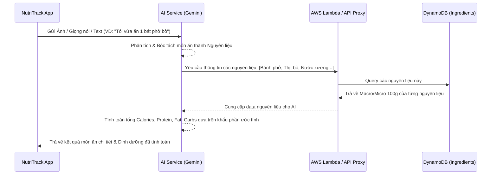
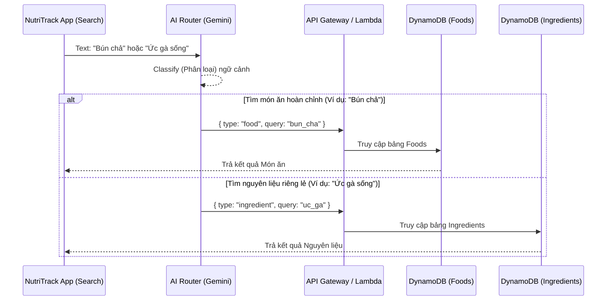

# Hướng dẫn Triển khai DB & Luồng Hoạt Động Mới (Cập nhật có AI)

Dựa trên yêu cầu mới của bạn, kiến trúc hệ thống nay đã thông minh hơn, lấy **AI (Gemini / AI Coach)** làm trung tâm điều phối và tính toán dinh dưỡng, kết hợp với hai cơ sở dữ liệu tách biệt: `Foods` (Món ăn) và `Ingredients` (Thành phần/Nguyên liệu).

Dưới đây là thiết kế luồng (Data Flow) chi tiết và cách thiết lập DynamoDB tương ứng.

---

## 1. Thiết kế Luồng Hoạt Động (Data Flow) Mới

### A. Luồng nhập liệu (Voice, Scan Ảnh, AI Coach Chat)
Khi người dùng **chụp ảnh (Scan)** bữa ăn, **nói (Voice)**, hoặc **chat (AI Coach)**:



* **Điểm nhấn**: AI không chỉ nhìn món ăn để tra cứu bảng `Foods` cứng nhắc, mà tự "bóc tách" (deconstruct) món ăn đó -> gọi bảng `Ingredients` -> tự cộng dồn chỉ số dinh dưỡng cho sát thực tế nhất.

### B. Luồng Tìm Kiếm (Search Function)
Khi người dùng gõ tìm kiếm trên thanh search (VD: "Ức gà", hoặc "Bún chả"):



* **Điểm nhấn**: AI đóng vai trò như một "nhân viên điều phối" (Router). Nó hiểu ý định người dùng muốn tìm công thức/món ăn hay tìm calo của một nguyên liệu thô để trỏ vào đúng Database.

---

## 2. Hướng dẫn Triển khai Lên AWS DynamoDB

Vì luồng đã thay đổi, bạn sẽ cần triển khai **hai bảng** phân biệt trên DynamoDB thay vì một.

### Bước 1: Tạo Hai Bảng Trên AWS Console

1. **Bảng 1: Nguyên Liệu (Ingredients)**
   - **Table name**: `NutriTrack_Ingredients`
   - **Partition key**: `ingredient_id` (Type: **String**)

2. **Bảng 2: Món Ăn (Foods)**
   - **Table name**: `NutriTrack_Foods`
   - **Partition key**: `food_id` (Type: **String**)

### Bước 2: Import Dữ Liệu (Code Node.js Cập nhật)

Bạn nên copy cả hai file `vietnamese_food_database.json` và `ingredients_database.json` chạy script import riêng cho từng bảng.

**Script mẫu (import_dynamodb.js):**
```javascript
const fs = require('fs');
const { DynamoDBClient } = require("@aws-sdk/client-dynamodb");
const { DynamoDBDocumentClient, PutCommand } = require("@aws-sdk/lib-dynamodb");

// Cấu hình AWS (nhớ thay đổi region)
const client = new DynamoDBClient({ region: "ap-southeast-1" });
const docClient = DynamoDBDocumentClient.from(client);

// HÀM IMPORT CHO BẢNG INGREDIENTS
async function importIngredients() {
    const rawData = fs.readFileSync('./db/ingredients_database.json', 'utf8');
    const dbData = JSON.parse(rawData);
    
    // Lưu ý: Đổi tên biến (ingredients hoặc foods) tùy cấu trúc file JSON cụ thể của bạn
    const items = dbData.ingredients || dbData.foods || []; 
    console.log(`Bắt đầu import ${items.length} nguyên liệu...`);

    for (let item of items) {
        const params = {
            TableName: "NutriTrack_Ingredients",
            Item: item
        };
        try {
            await docClient.send(new PutCommand(params));
            console.log(`[Thành công] Nguyên liệu: ${item.name_vi}`);
        } catch (error) {
            console.error(`[Lỗi] ${item.name_vi}:`, error);
        }
    }
}

// HÀM IMPORT CHO BẢNG FOODS
async function importFoods() {
    const rawData = fs.readFileSync('./db/vietnamese_food_database.json', 'utf8');
    const dbData = JSON.parse(rawData);
    
    const items = dbData.foods || []; 
    console.log(`\nBắt đầu import ${items.length} thực phẩm/món ăn...`);

    for (let item of items) {
        const params = {
            TableName: "NutriTrack_Foods",
            Item: item
        };
        try {
            await docClient.send(new PutCommand(params));
            console.log(`[Thành công] Món ăn: ${item.name_vi}`);
        } catch (error) {
            console.error(`[Lỗi] ${item.name_vi}:`, error);
        }
    }
}

async function run() {
    await importIngredients();
    await importFoods();
    console.log("Hoàn tất triển khai toàn bộ Database!");
}

run();
```

### Bước 3: Lưu ý khi viết Prompt cho AI (Gemini) ở Backend
Ở phía Lambda serverless gọi Gemini, bạn cần thêm prompt (system instruction) thật rõ ràng:

* **Cho tính năng Scan/Voice:** "Bạn là hệ thống phân tích dinh dưỡng. Hãy nhìn vào bức ảnh/văn bản này, liệt kê tất cả các loại **nguyên liệu thô** có trong đó kèm theo khối lượng ước tính (gram). Sau đó gọi API để tra cứu bảng Ingredients."
* **Cho tính năng Search:** "Nhận diện từ khóa của người dùng: '{text}'. Nếu đây là một nguyên liệu cơ bản (ví dụ: gạo, thịt lợn), hãy trả về JSON định dạng `{"type": "ingredient"}`. Nếu đây là một món ăn đã được nấu chín (ví dụ: phở, pizza), hãy trả về `{"type": "food"}`."
