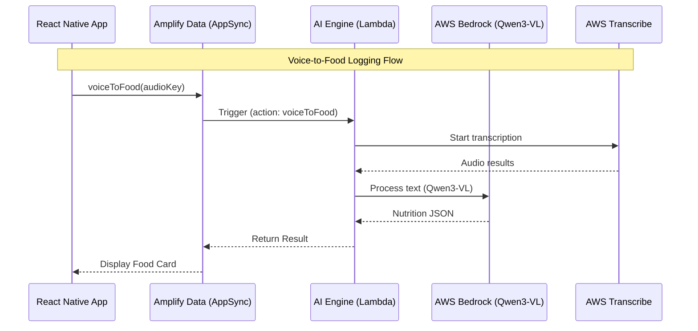

# NutriTrack 2.0

A modern nutrition-tracking mobile application targeting Vietnamese Gen Z/Millennials. Built with React Native (Expo) for the frontend and AWS Amplify Gen 2 for the backend, featuring AI-powered food analysis, voice logging, gamification, and an intelligent AI coach.

## 🌟 Key Features

- **📸 Food Photo & Voice Logging** — Capture meals via camera or voice commands with AI analysis
- **🤖 AI Coach (Bảo)** — Personalized nutrition guidance with bilingual support (Vietnamese/English)
- **🎮 Gamification** — Streaks, pet evolution, and challenges to keep users engaged
- **📊 Nutrition Tracking** — Comprehensive macro and micronutrient tracking with daily insights
- **🗣️ Voice Commands** — Hands-free food logging via Transcribe + Qwen3-VL AI
- **👥 Social Features** — Friend system, leaderboards, and shared challenges
- **⚡ Bilingual UI** — Full Vietnamese and English support
- **🔒 Secure Authentication** — Cognito-based auth with biometric support

## 🏗️ Architecture & AI Pipeline

NutriTrack uses a serverless, event-driven architecture powered by AWS Amplify Gen 2 and AWS Bedrock.



## 🛠️ Tech Stack

### Frontend
- **Framework** — Expo Router (React Native file-based routing)
- **State Management** — Zustand + AsyncStorage
- **AI Integration** — AWS Bedrock (Qwen3-VL)
- **Storage** — AWS Amplify Data (DynamoDB) + S3
- **Styling** — React Native (custom components)
- **Testing** — Jest + Expo preset + fast-check (property-based tests)

### Backend
- **Infrastructure** — AWS Amplify Gen 2 (CDK-based)
- **Database** — DynamoDB with GraphQL API
- **Compute** — AWS Lambda (Node.js)
- **Storage** — S3 (images, voice recordings)
- **AI Models** — Qwen3-VL (AWS Bedrock, ap-southeast-2)
- **Voice** — AWS Transcribe
- **Authentication** — Amazon Cognito (email + OTP, Google OAuth)

### CI/CD & Deployment
- **Frontend Hosting** — Amplify Hosting
- **Optional ECS** — Fargate for FastAPI services
- **Infrastructure** — Terraform (optional)

## 📁 Project Structure

```
NutriTrack/
├── frontend/                    # Expo React Native app
│   ├── app/                     # Expo Router screens (file-based routing)
│   │   ├── (tabs)/              # Main tab navigation
│   │   ├── (auth)/              # Auth flow
│   │   └── _layout.tsx          # Root layout
│   ├── src/
│   │   ├── store/               # Zustand stores
│   │   ├── services/            # API services
│   │   ├── components/          # Reusable components
│   │   ├── security/            # Security layer
│   │   ├── constants/           # Colors, typography
│   │   ├── i18n/                # Internationalization
│   │   └── lib/                 # Utilities
│   ├── MANHINH/                 # Pet evolution videos
│   ├── __tests__/               # Jest test files
│   └── package.json
│
├── backend/                     # AWS Amplify Gen 2
│   ├── amplify/
│   │   ├── backend.ts           # All AWS resources
│   │   ├── data/resource.ts     # GraphQL schema
│   │   ├── ai-engine/           # Lambda: AI handler
│   │   ├── process-nutrition/   # Lambda: Nutrition lookup
│   │   ├── friend-request/      # Lambda: Friend system
│   │   ├── resize-image/        # Lambda: Image processing
│   │   ├── auth/                # Cognito config
│   │   ├── storage/             # S3 config
│   │   └── package.json
│   ├── main.py                  # FastAPI entry (optional)
│   ├── routes/                  # FastAPI routes (optional)
│   └── requirements.txt
│
├── infrastructure/              # Terraform (optional)
├── ECS/                         # Docker & CI/CD
├── amplify.yml                  # Amplify Hosting config
└── CLAUDE.md                    # Developer guide
```

## 🚀 Quick Start

### Prerequisites
- Node.js 18+ (LTS)
- npm or yarn
- AWS Account with Amplify CLI
- Expo CLI: `npm install -g expo-cli`

### Frontend Installation

```bash
cd frontend
npm install --legacy-peer-deps
npm start
```

**Running on different platforms:**
```bash
npm run android      # Android
npm run ios          # iOS
npm run web          # Web
npm run build        # Export web build
```

### Backend Setup

```bash
cd backend
npx ampx sandbox                                    # Start sandbox
npx ampx generate outputs --outputs-out-dir ../frontend  # Sync config
```

**Sandbox Commands:**
```bash
npx ampx sandbox secret list                       # List secrets
npx ampx sandbox secret set KEY "value"            # Set secret
npx ampx sandbox delete                            # Clean up
```

### 🔐 Managing Secrets
NutriTrack requires specific model IDs stored as secrets in AWS Amplify.
```bash
# Set QWEN Model ID (Primary)
npx ampx sandbox secret set QWEN_MODEL_ID "qwen.qwen3-vl-235b-a22b"
```

## 🛠️ Internal Workflows

### Adding a New AI Action
1.  **Define the Action**: Add the logic to `backend/amplify/functions/ai-engine/handler.ts`.
2.  **Define the GraphQL Query**: Update `backend/amplify/data/resource.ts`.
3.  **Regenerate Outputs**: Run `npx ampx generate outputs` to update the frontend types.
4.  **Consume in Frontend**: Use `generateClient<Schema>()` in `frontend/src/services/aiService.ts`.

### Translation (i18n)
All text must be localized in `frontend/src/i18n/LanguageProvider.tsx`. Use the `t()` helper to ensure bilingual support.

## 🧪 Testing

```bash
# Run all tests
npm test

# Watch mode
npm run test:watch

# Coverage report
npm run test:coverage

# Property-based tests
npm run test:pbt

# Specific test file
npx jest path/to/file.test.tsx
```

**Test Setup:**
- Framework: Jest + Expo preset
- Property-based: fast-check
- Mocks: SecureStore, AsyncStorage, biometric APIs (see jest.setup.js)

## 🦄 Core Feature Deep Dive

### 🤖 Ollie (AI Coach) — Bilingual & Context-Aware
Ollie (named **Bảo** in Vietnamese) is more than just a chatbot. He is a personalized health advisor that:
- **Analyzes Trends**: Daily avg calories, macro ratios (Protein/Carbs/Fat), and consistency scores.
- **Bilingual Conversations**: Seamlessly switch between Vietnamese casual (slang, friendly) and energetic English.
- **Context-Aware**: Understands your current streak, pet level, and caloric goals before giving advice.
- **Food Suggestions**: Recommends meals based on items **expiring soon** in your fridge.

### 🍱 Kitchen & Fridge Management
Say goodbye to food waste. The Kitchen tab lets you:
- **Scan & Log**: Add items instantly.
- **Expiry Alerts**: Items are highlighted when nearing their expiration date.
- **Smart Recipes**: Generate up to 3 recipes using Bedrock AI that prioritize expiring ingredients.
- **Use Now**: Instantly log a fridge item into your daily meal log with one tap.

## 🐉 Gamification: The "Minh Long" (Dragon) Journey

To keep NutriTrack engaging, we've implemented a **180-day evolution journey** for your digital companion, the Dragon.

| Stage | Milestone | Visual State | XP Required |
|---|---|---|---|
| **Egg** | Day 0-35 | 🥚 Stationary Egg | 36 Days |
| **Newborn** | Day 36-71 | 👶 Small Hatchling | +36 Days |
| **Young** | Day 72-107 | 🐲 Growing Dragon | +36 Days |
| **Adult** | Day 108-143 | 🦖 Powerful Beast | +36 Days |
| **Legendary** | Day 144+ | 🔥 Majestic Ancient Dragon | 180 Total |

- **Streak Hero**: Maintain your daily streak to level up the "Streak Flame".
- **Podium Ranking**: Compete with friends based on **Streak** or **Pet Score**.
- **Badges**: Earn unique badges (Starter, Silver, Gold, Diamond, Legendary) as you progress.

## 🏗️ Architecture

### Authentication
1. Email + OTP signup
2. Optional Google OAuth
3. Biometric unlock (optional)
4. Secure session management

### AI Pipeline
- **Image Analysis** — Qwen3-VL (AWS Bedrock, ap-southeast-2)
- **Voice to Text** — AWS Transcribe
- **Nutrition Lookup** — DynamoDB fuzzy match → AI fallback
- **Coach** — Multi-action handler with 10 prompts

### Data Models
- `Food` — Nutrition database (~200 items)
- `user` — Profile, goals, gamification
- `FoodLog` — Meal history (owner-scoped, date GSI)
- `FridgeItem` — Inventory (owner-scoped)
- `Challenge` — Group challenges (hasMany/belongsTo)
- `Friendship` — Friend requests (owner-scoped, friend_id GSI)
- `UserPublicStats` — Leaderboard (owner write, authenticated read)

## 📊 Environments

| Environment | Lambda Prefix | Table Suffix | Trigger |
|---|---|---|---|
| **Sandbox** | `amplify-nutritrack-tdtp2--` | `tynb5fej6jeppdrgxizfiv4l3m` | Local |
| **feat/phase3** | `amplify-d1glc6vvop0xlb-fe-` | `vic4ri35gbfpvnw5nw3lkyapki` | Branch |
| **main** | `amplify-d1glc6vvop0xlb-ma-` | `2c73cq2usbfgvp7eaihsupyjwe` | Main |

## 🔐 Security

- **Biometric Auth** — Fingerprint/face unlock
- **Secure Storage** — SecureStore for tokens
- **Session Management** — JWTs with expiration
- **Data Redaction** — SecureLogger auto-redacts sensitive data
- **Screen Protection** — Screenshot detection + auto-lock
- **Input Validation** — At system boundaries only

### Environment Variables
```bash
AWS_REGION=ap-southeast-2
COGNITO_USER_POOL_ID=...
AI_SERVICE_SECRET_KEY=...
S3_UPLOADS_BUCKET=...
FOOD_TABLE_NAME=...         # Auto-discovered if omitted
```

## 🎯 Key Configurations

### Path Aliases
```json
// frontend/tsconfig.json
{
  "paths": {
    "@/*": ["./*"]
  }
}
```

### Design Tokens
- **Primary** — Dark Navy (#1B2838)
- **Accent** — Green (#2ECC71)
- **Typography** — `frontend/src/constants/typography.ts`
- **Colors** — `frontend/src/constants/colors.ts`

### i18n
```typescript
const { t, language, setLanguage } = useAppLanguage();
// t('key') — Vietnamese/English translation
```

## ⚠️ Known Issues

### Lambda Table Discovery
**Problem:** `discoverTables()` picks wrong table in multi-environment setup.  
**Fix:** Pass table names via env vars in `backend/amplify/backend.ts`.

### Peer Dependencies
**Problem:** React Native conflicts.  
**Fix:** Install with `npm install --legacy-peer-deps`.

### Android Emulator Connectivity
**Problem:** `adb` not found or emulator not connecting to local metro.  
**Fix:** Ensure `ANDROID_HOME` is set and run `adb reverse tcp:8081 tcp:8081`.

### Storage Path Issues
**Problem:** Image uploads fail with `AccessDenied`.  
**Fix:** Verify `Amplify.configure` is using the correct `amplify_outputs.json` and identity pool permissions are updated.

## 📝 Contributing

### Branch Strategy
- Features: `feat/name`
- Fixes: `fix/name`
- Chores: `chore/name`

### Code Quality
- Tests: `npm run test` (80% coverage)
- Logging: Use SecureLogger (frontend) or debug wrapper (backend)
- No console.log in production

## 🔗 Resources

- [AWS Amplify Docs](https://docs.amplify.aws)
- [Expo Router](https://expo.github.io/router)
- [AWS Bedrock](https://docs.aws.amazon.com/bedrock/)

## 📄 License

Proprietary — NeuraX HQ

---

**Last Updated:** 2026-04-05 | **Version:** 2.0 | **Status:** Active Development
